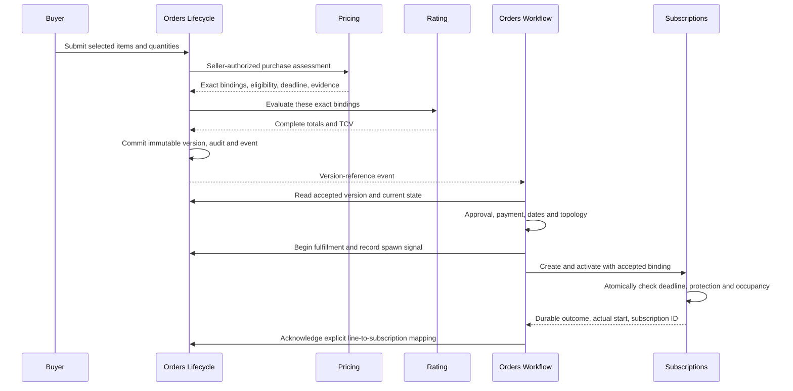

# Orders Lifecycle with PriceBook

This describes the amended design, not a deployed integration. It replaces the recovered Claude
session's frontier/renewal-pin explanation. The normative contract is
[Lifecycle DESIGN](../../gears/bss/orders-lifecycle/docs/DESIGN.md#contract-03-4-3).

An acquisition line identifies a plan revision and its selected items; a basket can contain several
plans. Optional choices and included allowances remain explicit. Pricing chooses the actual price
chain; a selected dimension and the pin's default-chain override are different fields.

An accepted order is a finite commercial promise. If price A was accepted and B starts before
activation, the proposed initial-binding contract preserves A while its evidence remains valid.
Ordinary subscription renewal can subsequently use B under Pricing's renewal rules. Orders never
uses renewal resolve to establish the first price.

The activation deadline is independent of state TTLs. A hold cannot extend it. At the exact deadline
new activation is refused; a retry of an activation already committed still returns its original
outcome. If only part of an order activated, Workflow compensates those subscriptions and voids
remaining drafts before acknowledging failure. Lifecycle retains its existing state machine.

Events identify the immutable version; authorized readers retrieve its complete commercial content.
The design caps consumed items and serialized version size separately. Even a 200-line event can
exceed 64 KiB when references grow, so admission must reserve space for terminal projections and
later administrative edits must preserve that budget.

[The counterpart proposals](2026-09-29-bss-seam-counterpart-amendments.md) identify the unfinished
work: Pricing purchase/acceptance SDKs, Product duration and protection policy, Rating aggregation,
Subscriptions atomic admission, authoritative overlap identity, topology ownership and the Workflow
approval adapter. Those are release blockers, not behavior supplied by this documentation change.
