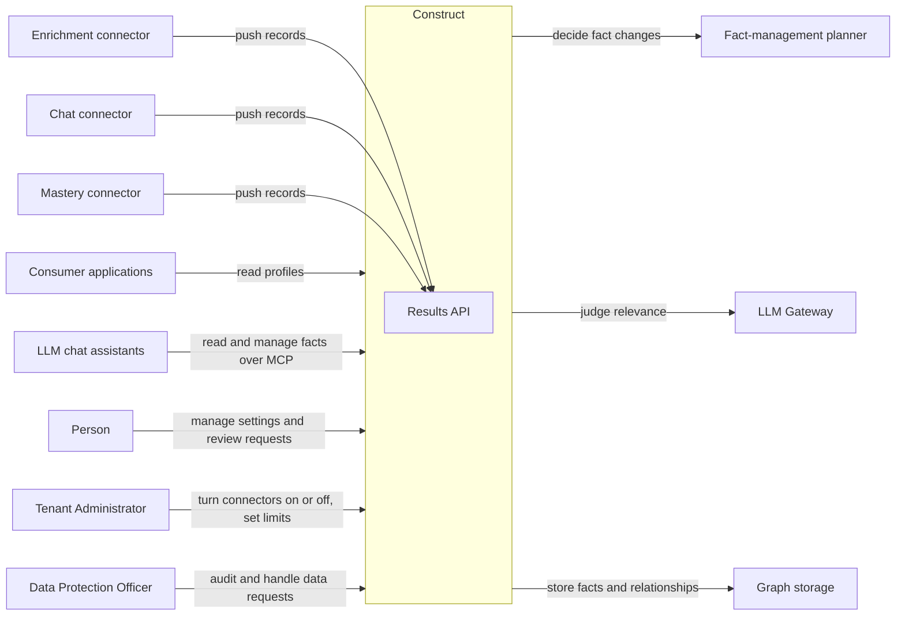

# PRD — Construct

<!-- toc -->

- [1. Overview](#1-overview)
  - [1.1 Purpose](#11-purpose)
  - [1.2 Background / Problem Statement](#12-background--problem-statement)
  - [1.3 Goals (Business Outcomes)](#13-goals-business-outcomes)
  - [1.4 Glossary](#14-glossary)
- [2. Actors](#2-actors)
  - [2.1 Human Actors](#21-human-actors)
  - [2.2 System Actors](#22-system-actors)
- [3. Operational Concept & Environment](#3-operational-concept--environment)
  - [3.1 Gear-Specific Environment Constraints](#31-gear-specific-environment-constraints)
- [4. Scope](#4-scope)
  - [4.1 In Scope](#41-in-scope)
  - [4.2 Out of Scope](#42-out-of-scope)
- [5. Functional Requirements](#5-functional-requirements)
  - [5.1 Data Intake from Connectors](#51-data-intake-from-connectors)
  - [5.2 Turning Records into Facts](#52-turning-records-into-facts)
  - [5.3 Profile Serving](#53-profile-serving)
  - [5.4 Person Control: Settings, Consent and Review Requests](#54-person-control-settings-consent-and-review-requests)
  - [5.5 Data-Subject Rights and Retention](#55-data-subject-rights-and-retention)
  - [5.6 Types](#56-types)
  - [5.7 Multi-Tenancy and Access Control](#57-multi-tenancy-and-access-control)
  - [5.8 Observability](#58-observability)
- [6. Non-Functional Requirements](#6-non-functional-requirements)
  - [6.1 Gear-Specific NFRs](#61-gear-specific-nfrs)
  - [6.2 NFR Exclusions](#62-nfr-exclusions)
- [7. Public Library Interfaces](#7-public-library-interfaces)
  - [7.1 Public API Surface](#71-public-api-surface)
  - [7.2 External Integration Contracts](#72-external-integration-contracts)
- [8. Use Cases](#8-use-cases)
- [9. Acceptance Criteria](#9-acceptance-criteria)
- [10. Dependencies](#10-dependencies)
- [11. Assumptions](#11-assumptions)
- [12. Risks](#12-risks)
- [13. Open Questions](#13-open-questions)
- [14. Traceability](#14-traceability)

<!-- /toc -->

## 1. Overview

### 1.1 Purpose

Construct keeps a living profile of a subject and serves it to the applications that need it. A subject is anything with a persistent identity (an identity that stays the same over time). In the first release, every subject is a person.

Connectors are separate services that collect data about subjects from many sources. They push records to Construct under GTS contracts. GTS is the Global Type System: the platform's system of versioned JSON Schema types, each with a `gts.` identifier. Construct checks each pushed record against its registered type. It turns accepted records into facts and stores the facts, and the relationships between them, in the platform's graph storage gear. Applications then read a structured profile of the subject from Construct, so they can adapt what they do to that person.

The picture below shows Construct in its context. It is a product picture: it shows who sends data and who reads it, not how Construct is built.

### 1.2 Background / Problem Statement

This gear replaces a Python service that runs Construct in production inside Constructor's platform. In the code this service is called "avatar"; this document calls it "the Python service". The Python service stores personalization facts about users, extracts such facts from chat conversations and from profile enrichment (finding public information about a person), tracks how well a learner masters a course, and serves the facts to chat assistants built on large language models (LLMs). What the Python service does is kept as features; its exact endpoints and data shapes are not kept. The gear relies on the platform for authentication, authorization, configuration and the type registry, on graph storage for storing facts, and on separate connector services for collecting data. What remains is Construct itself, and this document describes it.

Construct is assembled from platform parts, not built from nothing. The graph store exists as a Fabric gear: graph storage keeps a typed, multi-tenant graph in which every node and edge has a GTS type, accepts repeated writes of the same data without creating duplicates, and offers lexical, vector and hybrid search and bounded traversal (following relationships a limited number of steps). The connectors are built, and each connector owns its GTS contract and record types. Some parts of Construct, such as the fact-management planner, run as separate services.

What is missing is a Construct that runs as a Fabric gear on these parts, serves all callers of the Python service, and lets new sources of data be added without changing Construct's code.

### 1.3 Goals (Business Outcomes)

- **G1 — Construct runs as a Fabric gear and serves every caller of the Python service** (connectors, LLM assistants over MCP, and the frontend). Target: 100 % of the Python service's production traffic is served by the gear, and the Python service is switched off, by 2026-12-31 (end of 2026-Q4).
- **G2 — No feature is lost in the move.** Target: every feature of the Python service is mapped to the gear, to a connector, or to the platform, with zero features left unmapped, before cutover (and so no later than 2026-12-31).
- **G3 — Adding a source of facts needs no change to Construct's code.** Target: before cutover, at least one new connector with a new GTS record type goes live in a test tenant with only type registration and configuration, and with zero lines of Construct code changed.
- **G4 — Profile reads on the gear are no slower than on the Python service.** The reads that matter most come from the personalization pilot: the chat assistants in Constructor's learning products. Target: at cutover, profile reads answer at p95 no slower than the Python service's p95, measured over the 30 days before cutover.

### 1.4 Glossary

| Term | Definition |
|------|------------|
| Construct | This gear: it keeps a living profile of a subject and serves it to applications |
| Subject | The entity a profile is about: anything with a persistent identity. In the first release, every subject is a person |
| Person | A human subject. In data-protection terms, the data subject |
| Profile | The structured set of facts about one subject that Construct serves |
| Fact | One statement about a subject, with its origin, its collection time and, for uncertain sources, a confidence value. A correction replaces the fact, and Construct serves the latest value |
| Node | A graph storage term: one typed item in the graph. Facts and aspects are stored as nodes, and each node has a stable node key |
| Node key | A graph storage term: the stable identity of a node, unique within a tenant |
| Aspect | One area of a subject's profile, with its own GTS type. For a person, the aspects are identity, roles, skills and preferences |
| Connector | A separate service that collects data about subjects from one kind of source (for example chat, enrichment or mastery) and pushes records to Construct. A connector owns its GTS contract and record types. A connector never writes facts itself |
| Contract | A standing authorization for a connector to collect data from one source, for one subject or for a whole tenant. Its GTS base type is `gts.cf.connectors.core.contract.v1~`; each connector derives and owns its contract types |
| Record | One item a connector pushes to Construct about a subject. Its GTS base type is `gts.cf.connectors.core.record.v1~`; each connector derives and owns its record types |
| Provenance | The part of a record that says which source and which source record it came from |
| Origin | What Construct keeps on every fact about where it came from: the connector, the source record and the contract that authorized collecting it |
| Confidence | A value from the connector that says how likely a fact from an uncertain source is to be true |
| Fact candidate | A record from an uncertain source, for example enrichment, that proposes a fact. It becomes a fact only if it passes the admission rules |
| Admission rules | The rules a fact candidate must pass to become a fact: the source allow-list, the confidence floor, the trust tier and the caps on the number of facts |
| Source allow-list | The list of sources, for example web sites, from which fact candidates are accepted |
| Confidence floor | The lowest confidence value a fact candidate can have and still become a fact |
| Trust tier | A level of trust given to a kind of source; admission rules can require a minimum tier |
| Results API | The Construct interface that connectors use to deliver the records they collect |
| Fact-management planner | The service that decides how incoming data changes a subject's facts |
| Relevance judging | Deciding which of a subject's facts matter for one request, for example one chat conversation. Construct uses LLM Gateway for this |
| Personalization settings | Per-person settings: consent, roles, and the state of the banner and of profile questions in the chat |
| Banner | A notice about personalization that the host application shows to the person. Construct stores whether it has been shown |
| Profile question | A question a chat assistant asks the person to fill a gap in their profile |
| Review request | A record that a node of a subject's profile is marked as incorrect. It refers to the node by its node key. In this release, the person the profile describes creates it |
| Consent | The person's recorded permission for Construct to collect and serve data about them |
| Digital age of consent | The age below which a person cannot give consent to online data processing alone, so a parent or guardian gives it |
| Tenant | One customer organization on the platform. Its data is kept apart from every other tenant's data |
| Guardrail | A check that every fact candidate passes before it is stored. It looks for sensitive data in ten categories and gives one outcome: pass, block (the fact is not stored) or redact (the sensitive part is masked before the fact is stored) |
| Data category | A group of facts that share a kind, for example skills or mastery. Access decisions are made per data category |
| GTS | Global Type System: the platform's system of versioned JSON Schema types with `gts.` identifiers |
| Types Registry | The platform registry of GTS types |
| Graph storage | The platform gear that stores Construct's facts and the relationships between them as a typed, multi-tenant graph |
| LLM | Large language model |
| LLM Gateway | The platform gear through which gears call large language models |
| MCP | Model Context Protocol: the protocol LLM assistants use to call tools |
| GDPR | General Data Protection Regulation: the European Union's data-protection law |
| Cutover | The moment the gear takes over all production traffic of the Python service |

## 2. Actors

> **Note**: Stakeholder needs are managed at project/task level by the steering committee. This section documents actors (users, systems) that interact with this gear.

Data-protection roles are the same across the whole product. The customer organization (the tenant) is the data controller for its people's data. Constructor, which operates Construct, is a processor for the tenant. Connectors, graph storage, the fact-management planner and LLM Gateway are sub-processors inside the same deployment. Consumer applications receive data as processors of the same tenant. The person is the data subject. Each actor below repeats its role in one line.

### 2.1 Human Actors

#### Person

**ID**: `cpt-cf-construct-actor-person`

- **Role**: The human a profile describes; in this release, every subject is a person. The person is also the profile's owner: the profile acts on the person's behalf, including when it is served to other applications. The person sees, corrects and deletes their data, gives or withdraws consent, and marks nodes of their profile as incorrect.
- **Needs**: A profile that works for them in every application that reads it; clear control over what is collected and who reads it; a simple way to fix wrong data; deletion that really removes their data.
- **Data-protection role**: Data subject.

#### Tenant Administrator

**ID**: `cpt-cf-construct-actor-tenant-admin`

- **Role**: Operates Construct for one customer organization. Turns sources (connectors) on and off for the tenant, states the tenant's retention periods and whether it enrols people under the digital age of consent, and sees usage.
- **Needs**: Per-tenant control of sources; clear usage numbers; confidence that the tenant's data never mixes with another tenant's.
- **Data-protection role**: Acts for the data controller (the tenant).

#### Data Protection Officer

**ID**: `cpt-cf-construct-actor-dpo`

- **Role**: Handles data-subject requests (requests from a person to see, correct or delete their data) and audits what was collected, from where, under which contract, and who read it.
- **Needs**: The origin of every fact; a record of every read; deletion that can be checked; open review requests in one list.
- **Data-protection role**: Acts for the data controller (the tenant).

### 2.2 System Actors

#### Connector

**ID**: `cpt-cf-construct-actor-connector`

- **Role**: A separate service that collects data about subjects from one kind of source and pushes records to Construct's results API under a contract. It owns its GTS contract and record types. The first connectors are enrichment (public profile information about a person), chat (messages from chat assistants) and mastery (course mastery computed from the learning system). Finding sources, for example through web search, is a connector's job, not Construct's.
- **Data-protection role**: Sub-processor inside the same deployment.

#### Consumer Application

**ID**: `cpt-cf-construct-actor-consumer-app`

- **Role**: A host application or an LLM chat assistant that reads a subject's profile to adapt what it does. It reads only within the permissions the platform grants it. This actor covers integration into host applications: the application's team connects the application to Construct, and the running application is the actor.
- **Data-protection role**: Processor of the same tenant.

#### Graph Storage Gear

**ID**: `cpt-cf-construct-actor-graph-storage`

- **Role**: The platform gear that stores Construct's facts and the relationships between them, and searches and traverses them.
- **Data-protection role**: Sub-processor inside the same deployment.

#### Fact-Management Planner

**ID**: `cpt-cf-construct-actor-planner`

- **Role**: The service that decides how incoming data changes a subject's facts.
- **Data-protection role**: Sub-processor inside the same deployment.

#### LLM Gateway

**ID**: `cpt-cf-construct-actor-llm-gateway`

- **Role**: The platform gear Construct uses to judge which facts are relevant to a request.
- **Data-protection role**: Sub-processor inside the same deployment.

#### Platform AuthN/AuthZ

**ID**: `cpt-cf-construct-actor-platform-auth`

- **Role**: The platform's authentication (who is calling) and authorization (what the caller is allowed to do). It supplies the caller's identity and tenant with every request and decides every access.
- **Data-protection role**: Sub-processor inside the same deployment; it handles identity data only.

#### Types Registry

**ID**: `cpt-cf-construct-actor-types-registry`

- **Role**: The platform registry of GTS types. Connectors register their own contract and record types here; Construct registers the types for what it stores.
- **Data-protection role**: Holds type definitions only, no personal data.

## 3. Operational Concept & Environment

> **Note**: Runtime, OS, architecture, lifecycle policy, and gear integration patterns are defined in this repository's foundational documents — the [architecture manifest](../../../docs/ARCHITECTURE_MANIFEST.md) and [guidelines/](../../../guidelines/). This section captures only this gear's constraints.

### 3.1 Gear-Specific Environment Constraints

- Construct inherits graph storage's environment constraints; see the [graph storage PRD](../../graph-storage/docs/PRD.md), section 3.1.
- Construct needs graph storage deployed and reachable in the same deployment. Without it, Construct cannot store or serve facts.
- Construct needs LLM Gateway to judge which facts are relevant to a request.
- Construct needs the fact-management planner service to turn records into facts.
- Authentication and authorization are inherited from the platform. The API gateway authenticates the caller, the AuthN Resolver turns the result into a security context, and the AuthZ Resolver makes the policy decisions. Construct defines no login of its own.
- Connectors authenticate to Construct with application tokens, as platform services.

## 4. Scope

### 4.1 In Scope

- Accepting connector records through the results API under GTS contracts
- Checking every record against its registered type, and refusing invalid records with the violation named
- Recognising a repeated push of the same record and storing it once
- Guardrails that check every fact for sensitive data before it is stored
- Turning accepted records into changes to facts, with the changes from one record applied fully or not at all
- Registering with graph storage the GTS node and edge types for what Construct stores: the aspects of a person's profile (identity, roles, skills, preferences) and the facts in them, including mastery. Mastery is stored as facts in the graph like any other fact
- Serving a structured profile to consumer applications, and to LLM assistants over MCP: reading the facts relevant to a request, and managing facts on the person's instruction
- Personalization settings per person: consent, roles, and the state of the banner and of profile questions
- Review requests: a person marks any node of their profile as incorrect, which records a review request that refers to that node by its node key
- Data-subject rights: seeing, correcting and deleting data, with deletion reaching the facts derived from the deleted data
- Retention of facts and deletion at the end of the retention period
- Multi-tenancy and access control on every operation
- Logs, metrics and traces

### 4.2 Out of Scope

- Moving existing data and callers from the Python service to the gear. A separate migration design covers this, not this PRD.
- `subscribe` and `notify` on profile changes. This follows once graph storage's change events (optional, off by default in its PRD) are shipped and enabled.
- Fact version history. Construct keeps the latest value of each fact; a correction replaces it.
- Serving course content. The learning system and its connector own it.
- Construct acting on the person's behalf as an autonomous agent, that is, an agent that takes actions for the person without a request for each action. Not in this release.
- Taking a person's Construct out to run outside the platform (a "minimal live engine": a small, self-contained Construct that runs on its own).
- Links between the Constructs of different people (a "Construct Network": a network of linked Constructs).
- Profiles of subjects other than people.
- Generating tutoring content, or explaining material at a learner's level. Host applications do this, using the profile.
- Computing mastery. The mastery connector computes it and pushes the results.
- Collecting activity signals on devices or inside applications.
- Constructor Insight as a source. Constructor Insight is Constructor's product for measuring process and run-time behaviour. It can feed Construct only through a connector, if one is built.
- Notifications. Construct stores no notifications.

## 5. Functional Requirements

> **Testing strategy**: All requirements verified via automated tests (unit, integration, e2e) targeting 90%+ code coverage unless otherwise specified. Document verification method only for non-test approaches (analysis, inspection, demonstration).

### 5.1 Data Intake from Connectors

#### Record Intake Through the Results API

- [ ] `p1` - **ID**: `cpt-cf-construct-fr-record-intake`

The system **MUST** accept records that connectors push through the results API, one record in each push. Each record **MUST** name its registered record type, derived from the GTS record base `gts.cf.connectors.core.record.v1~`, and the contract under which it was collected. The system **MUST** answer each push with the outcome for its record: accepted, repeat, or refused with a reason.

- **Rationale**: Connectors are the only way facts enter Construct; one intake interface for all of them is what lets new sources join without Construct changes.
- **Actors**: `cpt-cf-construct-actor-connector`

#### Record Validation

- [ ] `p1` - **ID**: `cpt-cf-construct-fr-record-validation`

The system **MUST** check every record against its registered type, including every base type the record type derives from, before any fact is created from it. The system **MUST** refuse a record that fails the check, or whose type is not registered, and **MUST** name the type, the place in the record and the rule that was violated. A refused record **MUST NOT** change any stored data.

- **Rationale**: Many independent connectors write about the same subject; type checks at the door keep the profile consistent and tell the connector's owner exactly what to fix.
- **Actors**: `cpt-cf-construct-actor-connector`, `cpt-cf-construct-actor-types-registry`

#### Repeated Push Stored Once

- [ ] `p1` - **ID**: `cpt-cf-construct-fr-idempotent-intake`

The system **MUST** identify a record by its tenant, its connector, its provenance and its version. A repeated push of a record with the same identity **MUST** be accepted and reported as a repeat, and **MUST NOT** create a second fact or change existing facts.

- **Rationale**: Connectors re-deliver records as a normal part of their work (for example after a timeout); correctness has to come from recognising repeats, not from delivering each record exactly once.
- **Actors**: `cpt-cf-construct-actor-connector`

#### Collection Only Through Enabled Connectors with Consent

- [ ] `p1` - **ID**: `cpt-cf-construct-fr-collection-gate`

The system **MUST** accept records only from connectors the tenant has turned on, and only for people whose consent is recorded. Connectors own the scheduling of refreshes; the system **MUST** accept refreshed records only from connectors the tenant has turned on. The system **MUST NOT** discover sources itself. A record that fails this rule **MUST** be refused with the reason (connector turned off, or no consent).

- **Rationale**: The tenant and the person decide which sources are used; Construct never widens collection on its own.
- **Actors**: `cpt-cf-construct-actor-connector`, `cpt-cf-construct-actor-tenant-admin`, `cpt-cf-construct-actor-person`

#### Tenant Control of Sources

- [ ] `p1` - **ID**: `cpt-cf-construct-fr-tenant-sources`

The system **MUST** let a Tenant Administrator turn each connector on or off for the tenant. Turning a connector off **MUST** stop the acceptance of new records from that connector for the tenant from the next push on. Facts already collected stay until the person or the retention rules delete them.

- **Rationale**: The tenant, as data controller, decides which sources are used for its people.
- **Actors**: `cpt-cf-construct-actor-tenant-admin`

#### New Source Without Code Change

- [ ] `p1` - **ID**: `cpt-cf-construct-fr-new-source-by-config`

The system **MUST** accept records of a new record type from a new connector after only two steps: the type is registered in the Types Registry, and the connector is configured and turned on for the tenant. The system **MUST NOT** require any change to Construct's code for this.

- **Rationale**: This is goal G3; the set of sources grows faster than Construct is released.
- **Actors**: `cpt-cf-construct-actor-connector`, `cpt-cf-construct-actor-tenant-admin`, `cpt-cf-construct-actor-types-registry`

**Acceptance for 5.1**:

- Each push carries one record and gets one outcome: accepted, repeat, or refused; a refused record names the type, the place and the rule, and leaves stored data unchanged.
- A record of an unregistered type is refused.
- Pushing the same record twice gives one accepted record, one repeat and one fact.
- A record from a connector the tenant turned off, or for a person without recorded consent, is refused with that reason.
- After a Tenant Administrator turns a connector off, the next push from that connector for the tenant is refused, and facts it collected earlier are still served.
- A new connector with a new record type, registered and configured in a test tenant, has its records accepted and turned into facts with no Construct code change.

### 5.2 Turning Records into Facts

#### Correct Changes to Facts from Each Record

- [ ] `p1` - **ID**: `cpt-cf-construct-fr-planner-plan`

For each accepted record, the system **MUST** make the changes to the subject's facts that the record calls for: create a new fact, update an existing fact, skip data that adds nothing new, or delete a fact that the record contradicts. The changes **MUST** affect only the facts of the subject the record is about.

- **Rationale**: Deciding whether incoming data is new, an update, a repeat or a contradiction is the core of fact management; a wrong decision adds duplicates or loses true facts.
- **Actors**: `cpt-cf-construct-actor-planner`

#### All-or-Nothing Changes per Record

- [ ] `p1` - **ID**: `cpt-cf-construct-fr-atomic-plan`

The system **MUST** apply the set of changes from one record fully or not at all. Two concurrent updates for the same subject **MUST NOT** interleave: one completes before the other starts to apply its changes.

- **Rationale**: Half-applied changes, or the changes of two records mixed together, leave a profile that no source ever stated.
- **Actors**: `cpt-cf-construct-actor-planner`, `cpt-cf-construct-actor-graph-storage`

#### No Loss of Accepted Records

- [ ] `p1` - **ID**: `cpt-cf-construct-fr-no-lost-records`

If the changes from an accepted record cannot be decided or applied (for example because the planner or graph storage is not available), the system **MUST** keep the accepted record and process it again later, without applying any part of the failed changes. Every such failure **MUST** be counted in the metrics.

- **Rationale**: The connector moves past an accepted record and does not deliberately resend it; losing it would silently lose data.
- **Actors**: `cpt-cf-construct-actor-planner`, `cpt-cf-construct-actor-connector`

#### Origin on Every Fact

- [ ] `p1` - **ID**: `cpt-cf-construct-fr-fact-origin`

Every fact **MUST** carry its origin — the connector, the source record and the contract that authorized collecting it — and its collection time. A fact the person states directly **MUST** carry the person as its origin.

- **Rationale**: The person and the Data Protection Officer must be able to see where each fact came from, and deletion must be able to find every fact derived from a source.
- **Actors**: `cpt-cf-construct-actor-person`, `cpt-cf-construct-actor-dpo`, `cpt-cf-construct-actor-connector`

#### Confidence for Uncertain Sources

- [ ] `p1` - **ID**: `cpt-cf-construct-fr-confidence`

Facts from sources that are uncertain by nature, for example public web pages found by the enrichment connector, **MUST** carry the confidence value the connector supplies, and the system **MUST** return that value with the fact on every read. Facts from authoritative internal systems, for example the learning system's mastery data, and the person's own statements, **MUST** be accepted without a confidence value.

- **Rationale**: A public web page can describe a different person with the same name; an internal system of record cannot. Applications need to tell the two apart.
- **Actors**: `cpt-cf-construct-actor-connector`, `cpt-cf-construct-actor-consumer-app`

#### Admission Rules for Fact Candidates

- [ ] `p1` - **ID**: `cpt-cf-construct-fr-admission-rules`

A fact candidate **MUST** become a fact only if it passes the admission rules that apply to its source: the source allow-list, the confidence floor, the trust tier and the caps on the number of facts. Every refused candidate **MUST** be counted with its reason. Where these rules are applied — in each connector or in Construct at intake — is open question 3 in section 13.

- **Rationale**: Uncertain sources produce many weak candidates; without admission rules the profile fills with noise.
- **Actors**: `cpt-cf-construct-actor-connector`, `cpt-cf-construct-actor-tenant-admin`

#### Guardrails for Sensitive Data

- [ ] `p1` - **ID**: `cpt-cf-construct-fr-sensitive-data-guardrails`

Before storing a fact, the system **MUST** check it against these ten categories of sensitive data: personally identifiable information, health information, biometric data, financial information, authentication credentials, contact information, geolocation, political beliefs, sexual behaviour or orientation, and other protected categories (union membership, religion, criminal records). For each category, the check **MUST** give one outcome: pass, block (the fact is not stored) or redact (the sensitive part is masked before the fact is stored). The tenant **MUST NOT** be able to turn the guardrails off. Every block and every redaction **MUST** be counted per category, and the Data Protection Officer **MUST** be able to see these counts without seeing the sensitive content.

- **Rationale**: Chat messages and public web pages can contain special categories of personal data under GDPR Article 9, and credentials that must never be kept. Facts are stored only after this check, so the profile does not become a store of such data.
- **Actors**: `cpt-cf-construct-actor-connector`, `cpt-cf-construct-actor-dpo`, `cpt-cf-construct-actor-person`

#### Mastery as Facts

- [ ] `p1` - **ID**: `cpt-cf-construct-fr-mastery-facts`

The system **MUST** store the mastery results that the mastery connector pushes (how well a learner masters a course and its concepts) as facts in the graph, and **MUST** serve them in the profile like any other fact.

- **Rationale**: The learning pilot adapts to what the learner already knows; mastery is part of the profile, not a separate store.
- **Actors**: `cpt-cf-construct-actor-connector`, `cpt-cf-construct-actor-consumer-app`

#### Bounded LLM Work per Subject

- [ ] `p2` - **ID**: `cpt-cf-construct-fr-llm-budget`

The system **MUST** limit the LLM-backed work spent on one subject in a time window, with the limit set per tenant. The limit **MUST** apply only to LLM-backed work, such as relevance judging on reads. LLM-backed work over the limit **MUST** be delayed or refused, and every refusal **MUST** be counted in the metrics. An accepted record **MUST NOT** be dropped because of the limit; it is stored as `cpt-cf-construct-fr-no-lost-records` requires.

- **Rationale**: Very active chat users can otherwise run up LLM cost without limit; the Python service has this protection and it is kept. Records carry the subject's data and are never given up to save cost.
- **Actors**: `cpt-cf-construct-actor-tenant-admin`, `cpt-cf-construct-actor-llm-gateway`

**Acceptance for 5.2**:

- An accepted record creates, updates, skips or deletes facts as the record calls for, and each stored fact has origin and collection time.
- When applying a record's changes fails part-way, the subject's facts stay exactly as before, and the record is processed again later.
- Two concurrent records for the same subject produce the same final facts as the same two records applied one after the other.
- An enrichment fact carries the connector's confidence value on read; a mastery fact is accepted without one.
- A candidate that fails an admission rule does not become a fact and is counted with its reason.
- Mastery results pushed by the mastery connector are returned in the profile as facts.
- A chat record that states a health condition produces no stored health fact; a record that contains a password is refused; a record with a phone number among other facts is stored with the number masked; each case is counted per category and the count shows no sensitive content to the Data Protection Officer.
- Relevance judging over a subject's LLM limit is delayed or refused, and a refusal appears in the metrics; an accepted record for the same subject is still stored.

### 5.3 Profile Serving

#### Structured Profile Read

- [ ] `p1` - **ID**: `cpt-cf-construct-fr-profile-read`

The system **MUST** serve a structured profile of one subject to a consumer application: the subject's facts grouped by aspect and data category, each with its origin, its collection time and, where present, its confidence. The exact structure of the served profile is open question 6 in section 13 and is settled in the DESIGN.

- **Rationale**: Applications adapt to the person only if they can read the profile in a predictable form.
- **Actors**: `cpt-cf-construct-actor-consumer-app`

#### Facts Relevant to a Request

- [ ] `p1` - **ID**: `cpt-cf-construct-fr-relevant-facts`

Given the context of a request, for example a summary of a chat conversation, the system **MUST** return only the subject's facts that are relevant to it, judged through LLM Gateway. When the context lists open questions, the system **MUST** also report which of them no stored fact answers. Without a context, the system **MUST** return all facts the caller is allowed to read.

- **Rationale**: A chat assistant works best with the few facts that matter now, and it needs to know which questions it still has to ask.
- **Actors**: `cpt-cf-construct-actor-consumer-app`, `cpt-cf-construct-actor-llm-gateway`

#### MCP Tool: Read Relevant Facts

- [ ] `p1` - **ID**: `cpt-cf-construct-fr-mcp-tools`

The system **MUST** offer LLM assistants, over MCP, a tool that reads the facts relevant to a conversation, as `cpt-cf-construct-fr-relevant-facts` describes.

- **Rationale**: The personalization pilot's chat assistants use this capability today; goal G1 requires that it keeps working.
- **Actors**: `cpt-cf-construct-actor-consumer-app`

#### MCP Tool: Manage Facts on the Person's Instruction

- [ ] `p1` - **ID**: `cpt-cf-construct-fr-mcp-manage-facts`

The system **MUST** offer LLM assistants, over MCP, a tool that adds, replaces or deletes a fact that the person states or asks to change in the chat. The tool **MUST** return a summary of what changed.

- **Rationale**: The person often tells the assistant something new about themselves; the profile has to follow without a separate step.
- **Actors**: `cpt-cf-construct-actor-consumer-app`, `cpt-cf-construct-actor-person`

#### MCP Tool: Record the Profile-Question State

- [ ] `p1` - **ID**: `cpt-cf-construct-fr-mcp-question-state`

The system **MUST** offer LLM assistants, over MCP, a tool that records the profile-question state: which profile questions were asked, and whether the person turned such questions off and until when.

- **Rationale**: Without this state the assistant asks the same questions again, or asks after the person said stop.
- **Actors**: `cpt-cf-construct-actor-consumer-app`, `cpt-cf-construct-actor-person`

#### MCP Tools Act Only for the Identified Person

- [ ] `p1` - **ID**: `cpt-cf-construct-fr-mcp-caller-binding`

Every MCP tool call **MUST** act for the person the platform identifies for that call and for no other person.

- **Rationale**: An assistant serves one person at a time; a tool that could reach another person's facts would leak or damage them.
- **Actors**: `cpt-cf-construct-actor-consumer-app`, `cpt-cf-construct-actor-platform-auth`

#### Access Decided by the Platform

- [ ] `p1` - **ID**: `cpt-cf-construct-fr-profile-access`

Access to a profile **MUST** be decided by the platform's policy engine for each read, per tenant, per application and per data category. The tenant sets these policies through the platform's authorization tools; Construct defines no permission model of its own. A response **MUST** list only the data categories that contain facts the caller is allowed to read. A data category the caller is not allowed to read **MUST** be absent from the response, in a way the caller cannot tell apart from a category with no facts. A policy change or a withdrawn consent **MUST** take effect from the next read.

- **Rationale**: Permissions are platform-wide; one policy engine keeps them consistent across all gears and lets the tenant change or revoke them in one place.
- **Actors**: `cpt-cf-construct-actor-consumer-app`, `cpt-cf-construct-actor-platform-auth`, `cpt-cf-construct-actor-tenant-admin`

#### Served on the Person's Behalf

- [ ] `p1` - **ID**: `cpt-cf-construct-fr-on-behalf`

Every profile the system serves **MUST** describe one subject. A person's profile **MUST** be served on that person's behalf: it contains only data that the person's recorded consent covers and that the platform allows the reading application to see. Every response **MUST** name the subject it describes and **MUST** list only the data categories that contain facts the caller may read. The same profile **MUST** be servable to several applications at once, each within its own permissions.

- **Rationale**: The profile works for the person. When it is shared with applications, it stays visibly the person's, and each application sees only its permitted share.
- **Actors**: `cpt-cf-construct-actor-person`, `cpt-cf-construct-actor-consumer-app`

#### Latest Value for Every Reader

- [ ] `p1` - **ID**: `cpt-cf-construct-fr-latest-version`

When a person corrects a fact, the corrected fact **MUST** replace the old one for everyone who reads it. When a person deletes a fact, it **MUST** stop being served to everyone. After the change completes, a read **MUST NOT** return the old value.

- **Rationale**: A correction that some applications do not see is not a correction.
- **Actors**: `cpt-cf-construct-actor-person`, `cpt-cf-construct-actor-consumer-app`

#### Typed Client for Other Gears

- [ ] `p1` - **ID**: `cpt-cf-construct-fr-typed-client`

The system **MUST** offer profile reads to other gears through a typed Rust client that they obtain from the platform's client registry, with the same permissions and the same results as the REST interface.

- **Rationale**: Gears in the same deployment read profiles without a network call, and must not see more than REST callers.
- **Actors**: `cpt-cf-construct-actor-consumer-app`

**Acceptance for 5.3**:

- A permitted application reads a profile with facts grouped by aspect, each with origin, collection time and, where present, confidence.
- With a chat summary, only relevant facts are returned, and unanswered open questions are reported.
- The read-relevant-facts tool returns the facts relevant to the conversation; the manage-facts tool stores a fact the person states, with the person as origin, and returns a summary of the change; the profile-question tool records which questions were asked and until when questions are turned off.
- Each MCP tool works for the calling person and cannot read or change another person's facts.
- A denied data category and an empty data category produce the same response: the category is absent from both; after a policy change, the next read follows the new policy.
- Every response names its subject and lists only the data categories that contain facts the caller may read.
- After a correction, every reader gets the new value; after a deletion, no reader gets the fact.
- The typed client and REST return the same result for the same caller and request.

### 5.4 Person Control: Settings, Consent and Review Requests

#### Personalization Settings

- [ ] `p1` - **ID**: `cpt-cf-construct-fr-settings`

The system **MUST** keep personalization settings for each person: consent, roles, the banner state and the profile-question state. The person **MUST** be able to read and change their own settings; a chat assistant **MUST** be able to update the profile-question state for the person it serves.

- **Rationale**: These settings control how assistants talk to the person about their profile, and they exist in the Python service today.
- **Actors**: `cpt-cf-construct-actor-person`, `cpt-cf-construct-actor-consumer-app`

#### Consent

- [ ] `p1` - **ID**: `cpt-cf-construct-fr-consent`

The system **MUST** record when a person gives or withdraws consent. The system **MUST NOT** store new facts about a person whose consent is not recorded. When consent is withdrawn, collection for that person **MUST** stop and their facts **MUST** stop being served, from the moment of withdrawal. Deletion of the facts is a separate request (`cpt-cf-construct-fr-subject-delete`).

- **Rationale**: Consent is the legal basis for collecting and serving the profile; withdrawal must take effect at once, while the person decides separately whether to delete.
- **Actors**: `cpt-cf-construct-actor-person`

#### Seeing and Correcting One's Own Facts

- [ ] `p1` - **ID**: `cpt-cf-construct-fr-person-correct`

The person **MUST** be able to see all facts about them with their origin, and to correct any fact. A correction **MUST** replace the fact, with the person as its origin.

- **Rationale**: The person knows best what is true about them; the right to correct data is also a legal right.
- **Actors**: `cpt-cf-construct-actor-person`

#### Review Requests

- [ ] `p1` - **ID**: `cpt-cf-construct-fr-review-request`

The person **MUST** be able to mark any node of their profile as incorrect. This **MUST** record a review request with the node key, the subject, the time and an optional comment. The person **MUST** be able to see the state of their review requests.

- **Rationale**: Some wrong data cannot be fixed by a simple edit (for example a fact from an external source); the person needs a way to flag it for review.
- **Actors**: `cpt-cf-construct-actor-person`

#### Review Resolution

- [ ] `p1` - **ID**: `cpt-cf-construct-fr-review-resolution`

The system **MUST** list open review requests for the tenant's reviewers (a Tenant Administrator or the Data Protection Officer, as the tenant assigns). Resolving a request **MUST** record the outcome: corrected, deleted, or rejected with a reason. The person **MUST** see the outcome. Whether a node under an open review request is served meanwhile is open question 4 in section 13.

- **Rationale**: A review request that nobody sees or closes gives the person no real control.
- **Actors**: `cpt-cf-construct-actor-tenant-admin`, `cpt-cf-construct-actor-dpo`, `cpt-cf-construct-actor-person`

**Acceptance for 5.4**:

- A person reads and changes their own settings; an assistant updates the profile-question state for its person.
- For a person without recorded consent, pushed records are refused and no fact is created.
- After consent is withdrawn, records for the person are refused and profile reads return none of the person's facts, while the facts remain stored until deleted.
- A person's correction replaces the fact, with the person as origin.
- Marking a node incorrect creates a review request with node key, subject, time and comment; it appears in the tenant's open list; after resolution the person sees the outcome.

### 5.5 Data-Subject Rights and Retention

#### Access to One's Data

- [ ] `p1` - **ID**: `cpt-cf-construct-fr-subject-access`

On a data-subject request, the system **MUST** give the person, or the Data Protection Officer acting on the request, all data Construct holds about the person: facts with their origin, settings, review requests and the record of who read the profile.

- **Rationale**: The right of access requires a full answer, not only the facts an application shows.
- **Actors**: `cpt-cf-construct-actor-person`, `cpt-cf-construct-actor-dpo`

#### Export of One's Data

- [ ] `p2` - **ID**: `cpt-cf-construct-fr-subject-export`

The system **MUST** export the data in `cpt-cf-construct-fr-subject-access` in a structured, machine-readable format.

- **Rationale**: The right to data portability requires a format another system can read.
- **Actors**: `cpt-cf-construct-actor-person`, `cpt-cf-construct-actor-dpo`

#### Deletion

- [ ] `p1` - **ID**: `cpt-cf-construct-fr-subject-delete`

The person **MUST** be able to delete one fact or all their data. Deletion **MUST** reach the facts derived from the deleted data. From a request to delete all data on, the system **MUST** stop serving and collecting data for the person, and **MUST** treat the person's consent as withdrawn. Deleting all data **MUST** remove the person's facts, settings and review requests; the record of reads and of the deletion itself **MUST** be kept, without the deleted content, so the Data Protection Officer can prove the deletion. Deletion **MUST** complete within the time in `cpt-cf-construct-nfr-deletion-time`.

- **Rationale**: The right to erasure covers derived data too; a fact rebuilt from a deleted source would undo the deletion.
- **Actors**: `cpt-cf-construct-actor-person`, `cpt-cf-construct-actor-dpo`

#### Read Audit

- [ ] `p1` - **ID**: `cpt-cf-construct-fr-read-audit`

The system **MUST** record every read of a profile, through any interface: which application or assistant read it, for which person, which data categories, and when. The Data Protection Officer **MUST** be able to query these records per person and per application.

- **Rationale**: The DPO must be able to answer "who saw my data" for any person.
- **Actors**: `cpt-cf-construct-actor-dpo`, `cpt-cf-construct-actor-consumer-app`

#### Collection Audit

- [ ] `p1` - **ID**: `cpt-cf-construct-fr-collection-audit`

The Data Protection Officer **MUST** be able to see, per person, what was collected, from which source, through which connector and under which contract, and when.

- **Rationale**: Auditing collection is part of the controller's duty, and the tenant relies on Construct for it.
- **Actors**: `cpt-cf-construct-actor-dpo`

#### Retention

- [ ] `p1` - **ID**: `cpt-cf-construct-fr-retention`

The system **MUST** delete a fact when the tenant's retention period for its data category ends, counted from the fact's collection time. When a tenant is offboarded (leaves the platform), the system **MUST** delete all of the tenant's data. The default retention period is open question 1 in section 13.

- **Rationale**: Data must not be kept longer than needed for its purpose (storage limitation); deletion on request alone does not meet this.
- **Actors**: `cpt-cf-construct-actor-tenant-admin`, `cpt-cf-construct-actor-dpo`

#### Learners Under the Digital Age of Consent

- [ ] `p1` - **ID**: `cpt-cf-construct-fr-minors`

Construct is used in learning products, where some learners are minors. The system **MUST** let the tenant, as data controller, state whether it enrols people under the digital age of consent. For a person the tenant identifies as under that age, the system **MUST** require a recorded consent from a parent or guardian before it collects data. The system **MUST** refuse records for such a person until that consent is recorded. The exact age thresholds per country, and how guardian consent is recorded, are open question 2 in section 13.

- **Rationale**: The flagship pilot is a learning product; processing children's data without guardian consent breaks the law in many of the markets it serves. The laws that apply are Article 8 of the General Data Protection Regulation (GDPR) of the European Union (consent of a child for online services), COPPA (US children's online privacy) and FERPA (US education records).
- **Actors**: `cpt-cf-construct-actor-tenant-admin`, `cpt-cf-construct-actor-person`, `cpt-cf-construct-actor-dpo`

**Acceptance for 5.5**:

- An access request returns facts with origin, settings, review requests and the read record for the person.
- An export returns the same data as an access request, in a structured, machine-readable file that a program can parse without manual steps.
- Deleting a source record's facts also removes the facts derived from them; deleting all data leaves no facts, settings or review requests, and leaves a record of the deletion without content.
- From a delete-all request on, profile reads return none of the person's data and new records for the person are refused.
- Every profile read, by REST, typed client or MCP, appears in the read audit with application, person, categories and time.
- For each fact collected about a person, the collection audit shows the source, the connector, the contract and the time of collection.
- A fact past its tenant's retention period is deleted; an offboarded tenant has no data left.
- In a tenant that enrols minors, records for a person under the age are refused until guardian consent is recorded.

### 5.6 Types

#### Construct's Own Types

- [ ] `p1` - **ID**: `cpt-cf-construct-fr-own-types`

The system **MUST** register with graph storage the GTS node and edge types for what it stores: the aspects of a person's profile (identity, roles, skills, preferences) and the facts in them, including facts from chat, facts from enrichment and mastery facts, together with the edges that connect them to the subject and to each other. Connector contract and record types are not Construct's types: each connector owns and registers its own.

- **Rationale**: Graph storage checks every node and edge against its registered type; Construct's profile shape is defined by these types.
- **Actors**: `cpt-cf-construct-actor-graph-storage`, `cpt-cf-construct-actor-types-registry`

#### Type Evolution Without Data Loss

- [ ] `p2` - **ID**: `cpt-cf-construct-fr-type-evolution`

A new version of one of Construct's types **MUST NOT** make stored facts of an earlier version unreadable or invalid; facts of the earlier version **MUST** stay servable.

- **Rationale**: Profiles live for years, and types change more often than that.
- **Actors**: `cpt-cf-construct-actor-types-registry`, `cpt-cf-construct-actor-consumer-app`

**Acceptance for 5.6**:

- On start in an empty deployment, Construct's types are registered and graph storage accepts nodes and edges of these types.
- After a new version of a type is registered, facts stored under the earlier version are still returned on read.

### 5.7 Multi-Tenancy and Access Control

#### Tenant Isolation

- [ ] `p1` - **ID**: `cpt-cf-construct-fr-tenant-isolation`

Every operation **MUST** be confined to the caller's tenant. A read, search, count or error message **MUST NOT** reveal data of another tenant. This covers Construct's own data (settings, review requests, audit records) as well as the data in graph storage.

- **Rationale**: Profiles are personal data of many customer organizations in one deployment.
- **Actors**: `cpt-cf-construct-actor-platform-auth`, `cpt-cf-construct-actor-graph-storage`

#### Platform Authentication and Authorization

- [ ] `p1` - **ID**: `cpt-cf-construct-fr-access-control`

Every operation **MUST** be authenticated by the platform and authorized by the platform's policy engine. Pushing records, reading profiles, changing one's own settings and facts, resolving review requests, administering the tenant's sources, and reading audit records **MUST** be separate permissions. Connectors **MUST** authenticate with application tokens.

- **Rationale**: Each actor needs a different level of access; separate permissions let the tenant grant exactly what each needs.
- **Actors**: `cpt-cf-construct-actor-platform-auth`, `cpt-cf-construct-actor-connector`, `cpt-cf-construct-actor-tenant-admin`

**Acceptance for 5.7**:

- Tests that seed several tenants with the same subject identifiers find zero data of another tenant in any response, count or error.
- A caller without the matching permission is refused for each of the separate operations.

### 5.8 Observability

#### Logs, Metrics and Traces

- [ ] `p1` - **ID**: `cpt-cf-construct-fr-observability`

The system **MUST** produce logs, metrics and traces for every request. Metrics **MUST** include at least: records accepted, repeated and refused (by reason); record changes applied and failed; profile reads per application; and request latency.

- **Rationale**: Operators must see how a running instance behaves, and goal G4 is measured with these metrics.
- **Actors**: `cpt-cf-construct-actor-tenant-admin`

#### Readiness

- [ ] `p2` - **ID**: `cpt-cf-construct-fr-readiness`

The system **MUST** report whether it is ready to serve, and **MUST** report separately whether graph storage, the fact-management planner and LLM Gateway are reachable.

- **Rationale**: When one dependency is down, operators need to know which one without reading logs.
- **Actors**: `cpt-cf-construct-actor-tenant-admin`

#### Tenant Usage

- [ ] `p2` - **ID**: `cpt-cf-construct-fr-tenant-usage`

The system **MUST** show a Tenant Administrator the tenant's usage: the number of subjects with a profile, the number of facts per source, and the number of profile reads per application, per day.

- **Rationale**: The tenant needs to see what Construct does for its people and what it costs.
- **Actors**: `cpt-cf-construct-actor-tenant-admin`

**Acceptance for 5.8**:

- For a running instance, every request has a trace, log lines with the same trace id, and counts in the metrics listed above.
- With the planner stopped, readiness reports the planner as not reachable.
- A Tenant Administrator sees the usage numbers for the tenant only.

## 6. Non-Functional Requirements

> **Global baselines**: Project-wide NFRs are defined in the [architecture manifest](../../../docs/ARCHITECTURE_MANIFEST.md) and [guidelines/](../../../guidelines/). Storage, search and traversal performance is defined by the [graph storage PRD](../../graph-storage/docs/PRD.md), section 6. Only gear-specific NFRs are documented here.
>
> **Testing strategy**: NFRs verified via automated benchmarks, security scans, and monitoring unless otherwise specified.

### 6.1 Gear-Specific NFRs

#### Inherited Graph Performance

- [ ] `p1` - **ID**: `cpt-cf-construct-nfr-graph-performance`

Construct **MUST** stay within graph storage's performance envelope for storage, search and traversal, and adds no storage numbers of its own.

- **Threshold**: The ingest, search and traversal thresholds in section 6 of the [graph storage PRD](../../graph-storage/docs/PRD.md), for the graph sizes stated there
- **Rationale**: Graph storage owns the store and measures it; a second set of numbers for the same store would only disagree with it.
- **Architecture Allocation**: See DESIGN.md § NFR Allocation

#### Profile Read Latency Parity

- [ ] `p1` - **ID**: `cpt-cf-construct-nfr-read-latency`

Profile reads, including relevant-fact reads over MCP, **MUST** answer at p95 no slower than the Python service's p95 for the same operations.

- **Threshold**: p95 of the gear <= p95 of the Python service, measured over the 30 days before cutover, for the same operation and the same tenants
- **Rationale**: This is goal G4; chat assistants wait for the profile before they answer the person.
- **Architecture Allocation**: See DESIGN.md § NFR Allocation

#### Deletion Time

- [ ] `p1` - **ID**: `cpt-cf-construct-nfr-deletion-time`

A deletion **MUST** complete, including the facts derived from the deleted data, within 30 days of the person's request, of the end of the retention period, or of the tenant's offboarding.

- **Threshold**: <= 30 days from the request or the triggering event to complete removal from every read path and from storage
- **Rationale**: GDPR Article 12(3) requires a response to a data-subject request within one month.
- **Architecture Allocation**: See DESIGN.md § NFR Allocation

#### Zero Cross-Tenant Leakage

- [ ] `p1` - **ID**: `cpt-cf-construct-nfr-tenant-zero-leak`

An operation of Construct **MUST NOT** return or count data of another tenant. This includes Construct's own data, and it inherits graph storage's guarantee for the data kept there.

- **Threshold**: Zero occurrences in adversarial integration tests that seed several tenants with colliding subject identifiers, record identities and review requests
- **Rationale**: One deployment serves many customer organizations; any leak is a personal-data breach.
- **Architecture Allocation**: See DESIGN.md § NFR Allocation

#### Idempotent Intake Under Re-Delivery

- [ ] `p1` - **ID**: `cpt-cf-construct-nfr-idempotent-intake`

Routine re-delivery by connectors **MUST NOT** create duplicate facts, including when the same record arrives several times at the same moment.

- **Threshold**: Zero duplicate facts in tests that push every record at least three times, including concurrent pushes of the same record
- **Rationale**: Connectors re-deliver records on purpose; the profile must be the same whether a record came once or many times.
- **Architecture Allocation**: See DESIGN.md § NFR Allocation

#### Observability Coverage

- [ ] `p1` - **ID**: `cpt-cf-construct-nfr-observability`

Logs, metrics and traces **MUST** be available for every request, and visible for a running instance in the platform's standard observability tools.

- **Threshold**: 100 % of requests produce a trace and log lines with the same trace id; metrics visible within one minute of the event
- **Rationale**: Latency parity (G4) and intake health can be proven only with complete telemetry.
- **Architecture Allocation**: See DESIGN.md § NFR Allocation

### 6.2 NFR Exclusions

- High availability beyond the platform's default posture: Construct follows the platform's standard availability posture for gears, as the other gears in the same deployment do. The first release targets parity with the Python service, and gear-level clustering beyond the platform default is not required for that.
- Safety: Construct is an information service with no physical interaction, so no safety requirements apply.
- Accessibility and internationalisation: Construct has no user interface; the host applications that show profile data own accessibility and language.
- Documentation and support: the platform's defaults for gears apply; Construct adds no requirements of its own.

## 7. Public Library Interfaces

### 7.1 Public API Surface

#### Results API

- [ ] `p1` - **ID**: `cpt-cf-construct-interface-results-api`

- **Type**: REST API
- **Stability**: unstable
- **Description**: Used by connectors to deliver the records they collect. Each push carries one record and returns its outcome: accepted, repeat, or refused with the reason naming the type, the place and the rule.
- **Breaking Change Policy**: Path-versioned; a breaking change requires a new version, and the previous version stays available until every registered connector has moved.

#### Profile Read Interface

- [ ] `p1` - **ID**: `cpt-cf-construct-interface-profile-read`

- **Type**: REST API, and a typed Rust client that other gears obtain from the platform's client registry
- **Stability**: unstable
- **Description**: Serves a subject's structured profile, and the facts relevant to a request, to consumer applications within the permissions the platform grants. Both forms return the same results for the same caller.
- **Breaking Change Policy**: REST is path-versioned; the Rust client is versioned, and a breaking change introduces a new client version.

#### MCP Tools for LLM Assistants

- [ ] `p1` - **ID**: `cpt-cf-construct-interface-mcp-tools`

- **Type**: Protocol (MCP tools)
- **Stability**: unstable
- **Description**: Tools for LLM chat assistants: read the facts relevant to a conversation; manage facts on the person's instruction; record the profile-question state. Every tool acts only for the person the platform identifies for the call.
- **Breaking Change Policy**: A breaking change to a tool's inputs or outputs requires a new tool version, announced to the owners of the assistants that use it.

#### Person Control Interface

- [ ] `p1` - **ID**: `cpt-cf-construct-interface-person-control`

- **Type**: REST API
- **Stability**: unstable
- **Description**: Personalization settings and consent; seeing, correcting, exporting and deleting one's data; creating review requests and seeing their outcome; for the tenant's reviewers, listing and resolving review requests; for Tenant Administrators, the tenant settings (turning each connector on or off, the retention period per data category, whether the tenant enrols people under the digital age of consent, and the LLM limit per subject) and seeing usage; for the Data Protection Officer, the read and collection audit. Exporting one's data, seeing usage and the LLM limit are p2, as their requirements are.
- **Breaking Change Policy**: Path-versioned; breaking changes require a new version prefix.

### 7.2 External Integration Contracts

#### GTS Connector Contract Base

- [ ] `p1` - **ID**: `cpt-cf-construct-contract-gts-connector-contract`

- **Direction**: required from connectors
- **Protocol/Format**: GTS type `gts.cf.connectors.core.contract.v1~` (JSON Schema); each connector derives, owns and registers its own contract types
- **Compatibility**: A published GTS version is immutable; changes publish a new version, and every registered version stays accepted

#### GTS Record Base

- [ ] `p1` - **ID**: `cpt-cf-construct-contract-gts-record`

- **Direction**: required from connectors
- **Protocol/Format**: GTS type `gts.cf.connectors.core.record.v1~` (JSON Schema); each connector derives, owns and registers its own record types
- **Compatibility**: A published GTS version is immutable; a new record type or version is accepted after registration, with no Construct change

#### Construct Profile Types

- [ ] `p1` - **ID**: `cpt-cf-construct-contract-person-types`

- **Direction**: provided by Construct
- **Protocol/Format**: GTS node and edge types for what Construct stores: the aspects of a person's profile, for example `gts.cf.construct.person.identity.v1~`, and Construct's fact and edge types, registered with graph storage
- **Compatibility**: A published GTS version is immutable; changes publish a new version, and facts of earlier versions stay readable

#### Graph Storage Client

- [ ] `p1` - **ID**: `cpt-cf-construct-contract-graph-storage`

- **Direction**: required from graph storage
- **Protocol/Format**: Graph storage's typed client, as defined in the [graph storage PRD](../../graph-storage/docs/PRD.md), section 7
- **Compatibility**: Follows graph storage's versioning policy; Construct moves to a new client version when graph storage publishes one

#### LLM Gateway

- [ ] `p1` - **ID**: `cpt-cf-construct-contract-llm-gateway`

- **Direction**: required from LLM Gateway
- **Protocol/Format**: LLM Gateway's client, used for relevance judging
- **Compatibility**: Follows LLM Gateway's versioning policy

## 8. Use Cases

#### Chat Assistant Personalises an Answer

- [ ] `p1` - **ID**: `cpt-cf-construct-usecase-chat-personalise`

**Actor**: `cpt-cf-construct-actor-consumer-app`

**Preconditions**:

- The person has recorded consent and has facts in the profile
- The assistant is allowed by the platform to read the person's profile

**Main Flow**:

1. The person asks the chat assistant a question
2. The assistant sends Construct a summary of the conversation over MCP
3. Construct returns the facts relevant to the conversation, and the open questions no fact answers
4. The assistant answers, adapted to the person, and can ask a profile question to fill a gap
5. The assistant records the profile-question state
6. Construct records the read in the read audit

**Postconditions**:

- The answer uses the person's relevant facts; the read is audited

**Alternative Flows**:

- **The person tells the assistant a new fact about themselves**: the assistant calls the manage-facts tool; Construct stores the fact with the person as origin and reports what changed

#### Enrichment on Onboarding

- [ ] `p1` - **ID**: `cpt-cf-construct-usecase-enrichment-onboarding`

**Actor**: `cpt-cf-construct-actor-connector`

**Preconditions**:

- The tenant has turned the enrichment connector on, and the new person has recorded consent
- A contract authorizes the enrichment connector to collect for this person, or for the whole tenant

**Main Flow**:

1. The enrichment connector finds the person's public profile and pushes fact candidates, each with a confidence value
2. Construct checks each record against its type and accepts the valid ones
3. Construct turns the candidates that pass the admission rules into facts
4. The new facts appear in the person's profile with origin and confidence

**Postconditions**:

- The profile holds the accepted enrichment facts; each can be traced to its public source

**Alternative Flows**:

- **A candidate is below the confidence floor**: it is not stored, and it is counted with its reason

#### Mastery Update from the Learning System

- [ ] `p1` - **ID**: `cpt-cf-construct-usecase-mastery-update`

**Actor**: `cpt-cf-construct-actor-connector`

**Preconditions**:

- The mastery connector is turned on for the tenant, and the learner has recorded consent (a guardian's consent where the learner is under the digital age of consent)

**Main Flow**:

1. The mastery connector computes new mastery results for the learner and pushes them
2. Construct accepts the records and updates the learner's mastery facts
3. The next profile read returns the new mastery facts

**Postconditions**:

- The learning product adapts to the new mastery level

**Alternative Flows**:

- **The connector pushes the same results again**: Construct reports repeats and creates no new facts

#### Person Marks a Node Incorrect

- [ ] `p1` - **ID**: `cpt-cf-construct-usecase-review-request`

**Actor**: `cpt-cf-construct-actor-person`

**Preconditions**:

- The person has a profile with at least one node

**Main Flow**:

1. The person marks a node of their profile as incorrect and adds a comment
2. Construct records a review request with the node key, the subject, the time and the comment
3. The request appears in the tenant's list of open requests
4. A reviewer resolves it as corrected, deleted, or rejected with a reason
5. The person sees the outcome

**Postconditions**:

- The review request is closed with a recorded outcome; if corrected, readers get the new value

**Alternative Flows**:

- **The reviewer rejects the request**: the node stays as it was, and the person sees the reason

#### Person Deletes All Their Data

- [ ] `p1` - **ID**: `cpt-cf-construct-usecase-delete-all`

**Actor**: `cpt-cf-construct-actor-person`

**Preconditions**:

- The person has a profile

**Main Flow**:

1. The person asks to delete all their data
2. Construct stops serving and collecting the person's data at once, and treats the person's consent as withdrawn
3. Construct deletes the person's facts, the facts derived from them, their settings and their review requests
4. Construct keeps a record of the deletion without the deleted content

**Postconditions**:

- Within 30 days of the request, no read path and no storage holds the person's data; the Data Protection Officer can prove the deletion

**Alternative Flows**:

- **A connector pushes a new record for the person after deletion**: the record is refused, because the person has no recorded consent

#### Tenant Adds a New Connector

- [ ] `p2` - **ID**: `cpt-cf-construct-usecase-new-connector`

**Actor**: `cpt-cf-construct-actor-tenant-admin`

**Preconditions**:

- A new connector exists with a new record type derived from the GTS record base

**Main Flow**:

1. The connector's record type is registered in the Types Registry
2. The Tenant Administrator configures the connector and turns it on for the tenant
3. The connector pushes records; Construct accepts them and turns them into facts

**Postconditions**:

- The new source feeds profiles, and Construct's code did not change

**Alternative Flows**:

- **The type is not registered**: Construct refuses the records and names the missing type

#### Request for a Person Without Consent Is Refused

- [ ] `p1` - **ID**: `cpt-cf-construct-usecase-no-consent`

**Actor**: `cpt-cf-construct-actor-connector`

**Preconditions**:

- The person has not given consent, or has withdrawn it

**Main Flow**:

1. A connector pushes a record for the person
2. Construct refuses the record with the reason "no consent" and stores nothing
3. An application that reads the person's profile gets no facts

**Postconditions**:

- No data about the person is collected or served

**Alternative Flows**:

- **The person gives consent later**: new records are accepted from that moment on

## 9. Acceptance Criteria

- [ ] In production, 100 % of the Python service's traffic (connectors, MCP assistants and frontend) is served by the gear, and the Python service is switched off, by 2026-12-31 (G1)
- [ ] A signed-off mapping lists every feature of the Python service against the gear, a connector or the platform, with zero unmapped features, before cutover (G2)
- [ ] A new connector with a new record type goes live in a test tenant with only type registration and configuration, and no Construct code change (G3)
- [ ] At cutover, profile-read p95 on the gear is no slower than the Python service's p95 over the previous 30 days (G4)
- [ ] Every use case in section 8 passes as an end-to-end test on a staging deployment
- [ ] Adversarial multi-tenant tests find zero data of another tenant in any response
- [ ] A full deletion request is completed and verified within 30 days, and leaves a record of the deletion without content
- [ ] The compliance and security review is passed before the first production tenant is served
- [ ] `cfs validate` passes for this gear's documentation set

## 10. Dependencies

| Dependency | Description | Criticality |
|------------|-------------|-------------|
| Graph storage gear | Stores and serves Construct's facts and relationships; typed, multi-tenant, idempotent ingest, search and traversal. Its code is in review and not yet merged to the main branch | p1 |
| GTS and Types Registry | Validation of records against the record types that connectors own and register; registration of the types for what Construct stores | p1 |
| Platform AuthN/AuthZ | Caller identity, tenant and security context; policy decisions for every operation | p1 |
| Fact-management planner service | Decides how incoming data changes a subject's facts | p1 |
| LLM Gateway | LLM calls for relevance judging | p1 |
| Connectors (enrichment, chat, mastery) | The sources of all records pushed to Construct | p1 |
| API gateway | Authenticates external callers and routes them to Construct | p1 |
| Real removal of data in graph storage | Erasure, retention expiry and tenant offboarding need graph storage to remove data for real (hard delete or purge, and tenant offboarding). Graph storage's own PRD lists these as out of scope or p2 for its first version | p1 |
| Compliance and security review | Review of data protection and security before the first production tenant | p1 |

## 11. Assumptions

- Graph storage is merged and deployable in Constructor's environments before Construct's integration testing starts.
- Connectors keep their record identity (tenant, connector, provenance, version) stable across re-deliveries.
- The platform identifies the person and the tenant on every request, including MCP calls from chat assistants.
- The tenant, as data controller, collects the person's consent in its own product flow, and Construct records it.
- The Python service's p95 profile-read latency is measured in production over the 30 days before cutover, so the G4 baseline exists.
- Mastery results arrive computed from the mastery connector; Construct does not compute them.

## 12. Risks

| Risk | Impact | Mitigation |
|------|--------|------------|
| Graph storage lands later than planned | Construct cannot store facts in production; cutover (G1) slips | Track graph storage's review closely; build and test Construct against graph storage's in-review code; raise gaps with its owner as named requests early |
| LLM Gateway is not ready in production when the gear is | Relevance judging is not available, so relevant-fact reads fail | Relevance judging is the only dependency on LLM Gateway; the cutover waits for it (open question 5) |
| Graph storage cannot remove data for real in its first version | Deletion on request, retention expiry and tenant offboarding cannot be completed, and the 30-day deletion time is missed | Raise hard delete, purge and tenant offboarding with the graph-storage owner before the first production tenant |
| Features are lost in the move | Pilot users lose a capability after cutover | The G2 feature mapping, signed off before cutover; every use case in section 8 tested end to end |
| Consent rules for minors are unclear | Learning tenants that enrol minors cannot go live, or go live out of compliance | Open question 2 answered with legal before the first learning tenant; until then, collection for people under the digital age of consent is refused |
| Latency parity is not met because relevance judging adds an LLM call | G4 fails at cutover | Measure the Python service's baseline early; include the relevance-judging call in the parity test from the first build |

## 13. Open Questions

1. What is the default retention period for each data category? Owner: Anastasia Berseneva (Construct product owner), with the Data Protection Officer. Target date: 2026-10-30.
2. What are the digital age-of-consent thresholds per country for learning tenants, and how is a parent's or guardian's consent recorded? Owner: Anastasia Berseneva (Construct product owner), with legal. Target date: 2026-10-30.
3. Who owns the admission rules (source allow-list, confidence floor, trust tier, caps) that decide which facts from connectors are accepted: each connector, or Construct at intake? Owner: Yehor Komarov (Construct tech lead). Target date: 2026-10-16.
4. Is a node under an open review request still served while the request is open? Owner: Anastasia Berseneva (Construct product owner). Target date: 2026-10-16.
5. Is LLM Gateway available in production for relevance judging by the cutover? Owner: Yehor Komarov (Construct tech lead). Target date: 2026-10-16.
6. What is the structure of the served profile: its hierarchy, and the required properties of each node (category, origin, context)? Owner: Yehor Komarov (Construct tech lead); settled in the DESIGN. Target date: 2026-10-16.

## 14. Traceability

Links to related specification artifacts.

- **Design**: `DESIGN.md` in this folder, to follow
- **ADRs**: `ADR/` in this folder, to follow
- **Features**: `features/` in this folder, to follow
- **Graph storage**: [graph storage PRD](../../graph-storage/docs/PRD.md)
